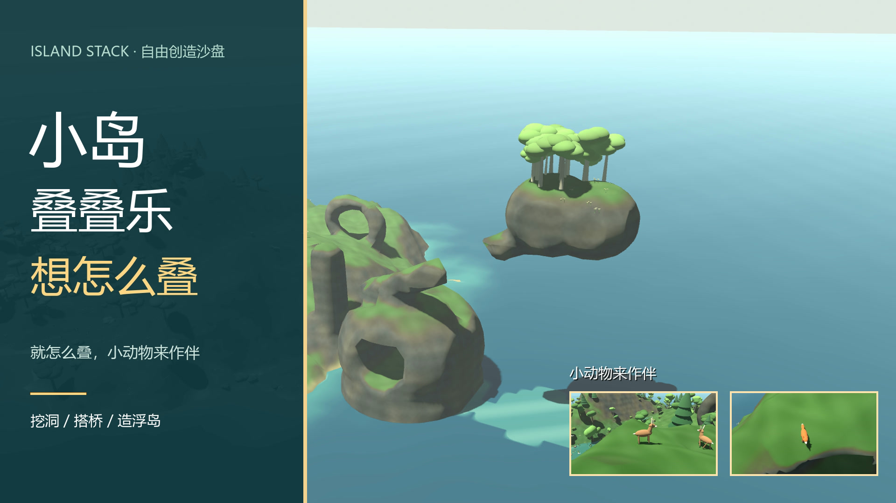
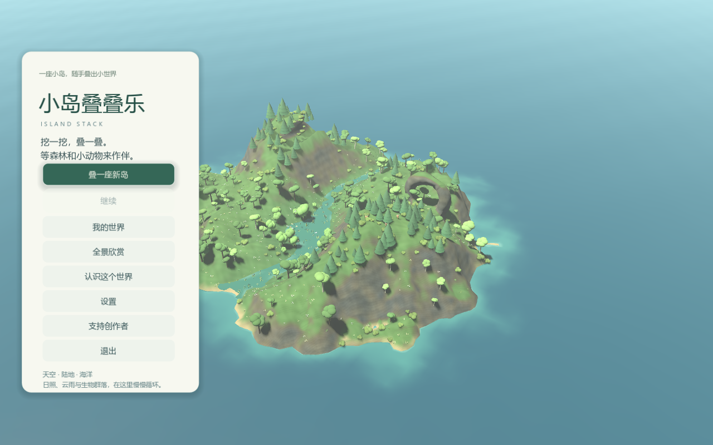
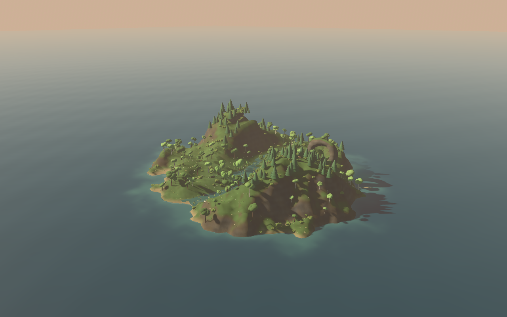
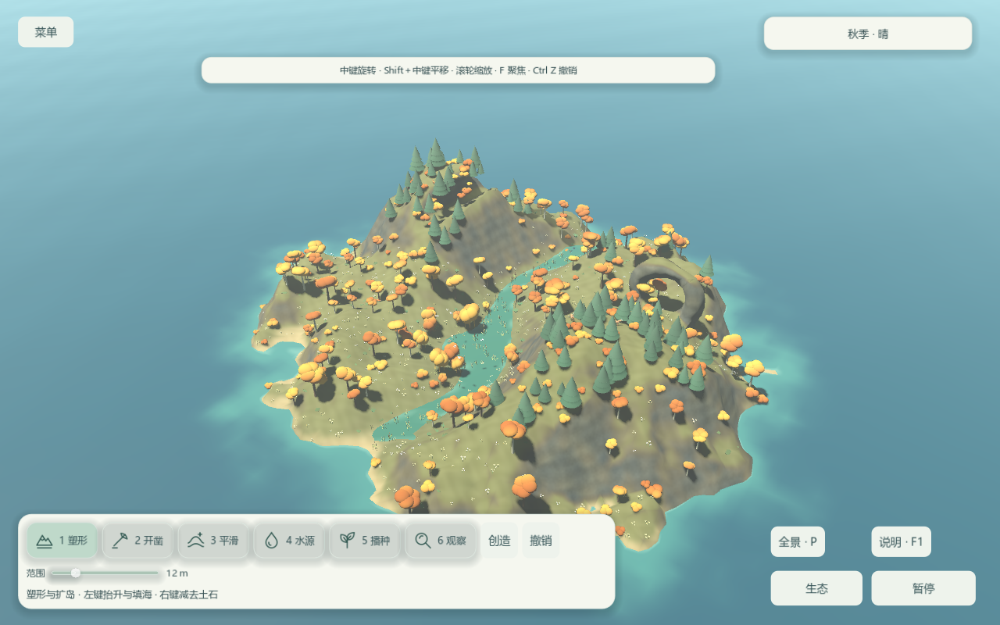
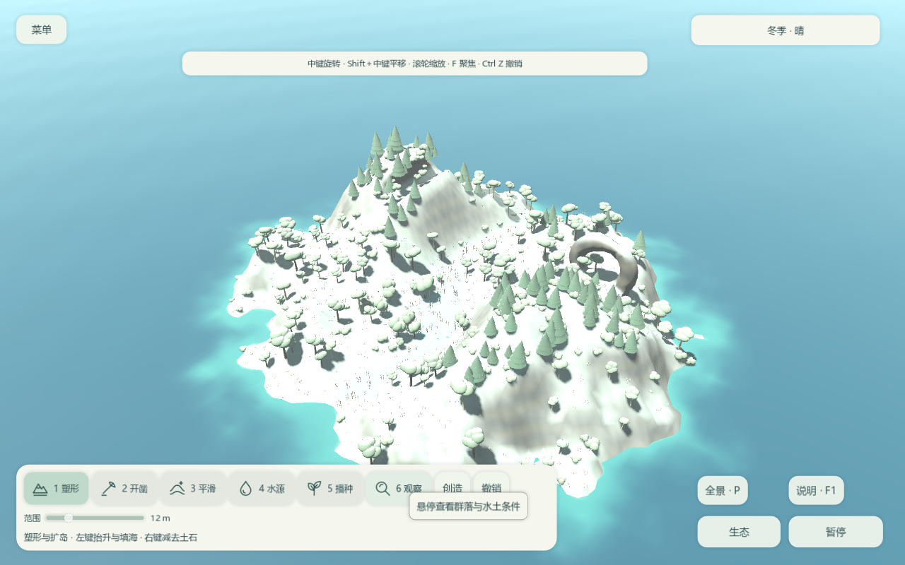

# 小岛叠叠乐 · Island Stack

**想怎么叠，就怎么叠。**

一个可以造山、填海、挖洞、种森林，也可以静静看晨昏与四季的三维生态沙盘。

[下载 Windows 版](https://github.com/infinitytom/tideborn-island/releases/latest) · [观看宣传片](https://github.com/infinitytom/tideborn-island/releases/download/v0.3.4/IslandStack-Trailer.mp4) · [下载封面](https://github.com/infinitytom/tideborn-island/releases/download/v0.3.4/IslandStack-Cover.png) · [完整操作说明](使用说明.md)

## 开始游玩

1. 下载 Releases 中的 **IslandStack-v0.3.4-Windows-x64.zip**。
2. 完整解压，双击 **IslandStack.exe** 或「启动游戏.cmd」。
3. 点击「认识这个世界」了解操作；「全景欣赏」可以直接看看小岛。

运行包已包含定制引擎，无需安装 Godot。请保留 exe 旁边的 pck 文件。

## 亲手创造

- 真正的三维体素地形：填海、造山、开洞、隧道与悬挑。
- 范围 3–48 米的笔刷、可调塑形力度、指定高度悬空塑形，以及撤销与重做。
- 悬停显示绿色添加、红色开凿的半透明影响范围；抬升更明显，夜间有月光照亮施工地形。
- 按住鼠标时在原落点向上叠加，按实际时间与力度抬升；「自然笔触」给建造和开凿边缘添加轻微起伏，可在创造面板关闭。
- 自然播种，让环境筛选群落；自由创造可直接种植并保留 12 种植物。
- 水源、土壤湿度、地表水与近海生态相互联系。泉眼贴合地形，以细涟漪融入景物；使用水源工具靠近时显示边缘提示，右键可移除。
- 春夏绿意、秋季金红叶片、冬季雪地与湖冰，晨昏连续渐变。
- **P 全景模式**：隐藏全部界面和笔刷，缓慢环绕，生态继续运转。P / Esc 返回；中键、滚轮仍可调整镜头。
- 原创循环音乐、海浪雨声与操作音效，可独立调节音量。
- 鹿与狐狸随栖息地条件出现，慢走、停步低头、巡游与摆尾，近景更容易观察。
- 岛屿保存、自动保存、历史记录和数字种子；改名后保留原存档位置。
- 不同种子改变岛形、海湾、山体比例、河湖位置与朝向；同种子可重现，旧存档保留原有地形。
- 主界面「我的世界」管理旧岛屿；新建、切换自动保留当前世界，旧世界可打开或确认删除。

| 秋季 | 冬季 |
| --- | --- |
|  |  |

## 常用操作

| 操作 | 键鼠 |
| --- | --- |
| 塑形 / 减去土石 | 工具 1，左键 / 右键 |
| 三维开凿 | 工具 2，左键；Shift 固定高度 |
| 平滑 | 工具 3，左键 |
| 放置 / 移除水源 | 工具 4，左键 / 右键 |
| 连续播种、种植 / 清除植物 | 工具 5，按住左键 / 右键 |
| 观察环境 | 工具 6，悬停 |
| 旋转 / 平移 / 缩放 | 中键 / Shift＋中键或 WASD / 滚轮 |
| 近看 / 全景 | F / P |
| 暂停 / 生态 / 帮助 | 空格 / Tab / F1 |
| 保存 / 读取 | F5 / F9 |

## 模型范围

可塑造区域约 1024×1024 米，高度约 -56～952 米，笔刷整体需留在边界内。生态采样最高地表，洞内和浮岛下方没有独立生态；水是地表浅水近似，海洋是整体指标，动物是简化表现。这是创作与观察用的沙盘。

## 支持创作者

游戏开始界面仅显示「支持创作者」按钮，点击后再弹出创作者的支付宝赞赏码。支持完全自愿。

## 开发与验证

源码位于 game。地形依赖原生 **Voxel Tools** 类，普通未集成该模块的 Godot 无法直接运行。当前运行包使用本项目已验证的 Godot 4.7.2 double 定制构建。可从下载包取得运行库，将 exe 另存为 godot-voxel.exe，再用它打开源码工程：

~~~powershell
.\godot-voxel.exe --editor --path .\game
.\godot-voxel.exe --headless --path .\game --script res://tests/eco_test.gd
.\godot-voxel.exe --headless --path .\game --export-pack "Windows Portable" .\dist\IslandStack.pck
~~~

打包脚本：`tools/build_portable.ps1 -EnginePath .\godot-voxel.exe`。宣传片镜头脚本：`tools/capture_promo.gd`，使用真实场景录制。

生态测试 12 项通过。新增图形验证覆盖鹿与狐狸贴地行走、存档重建、真实鼠标路径的悬空塑形、笔刷操作音效与撤销重做。下载包实测覆盖音频输出、赞赏码弹窗、全景模式与退出、高处地形创建和存档恢复、撤销重做、自由种植、晨昏与季节、键鼠、洞穴、填海及开凿。详细结果见 [验证记录](验证记录.md)。

[第三方运行库许可](THIRD_PARTY_NOTICES.txt) · [问题反馈](https://github.com/infinitytom/tideborn-island/issues)
